# dev-workflow
Status: stable

## Overview

The front door. This repo's value is the spine
(`spec-from-idea -> plan-from-spec -> implement -> review-code ->
finish-branch`) plus supporting skills that plug into it. This skill is
just the routing table — it has no process of its own beyond picking the
right next skill.

## Routing

```dot
digraph routing {
    "What's the task?" [shape=diamond];
    "Feasibility question only" [shape=box];
    "Nothing written down yet" [shape=box];
    "Spec/requirements exist, no plan" [shape=box];
    "Plan exists, writing code" [shape=box];
    "Code written, about to commit/push" [shape=box];
    "Review passed, ready to land" [shape=box];
    "Something's broken" [shape=box];
    "Merge/rebase conflict" [shape=box];
    "Backlog needs grooming" [shape=box];
    "A plan/decision needs pressure-testing" [shape=box];
    "Context needs to move to another session" [shape=box];

    "What's the task?" -> "Feasibility question only" -> "spec-from-idea (spike path)";
    "What's the task?" -> "Nothing written down yet" -> "spec-from-idea";
    "What's the task?" -> "Spec/requirements exist, no plan" -> "plan-from-spec";
    "What's the task?" -> "Plan exists, writing code" -> "implement";
    "What's the task?" -> "Code written, about to commit/push" -> "review-code";
    "What's the task?" -> "Review passed, ready to land" -> "finish-branch";
    "What's the task?" -> "Something's broken" -> "debug-systematically";
    "What's the task?" -> "Merge/rebase conflict" -> "resolve-merge-conflicts";
    "What's the task?" -> "Backlog needs grooming" -> "triage-issues";
    "What's the task?" -> "A plan/decision needs pressure-testing" -> "grill-me";
    "What's the task?" -> "Context needs to move to another session" -> "handoff";
}
```

## Quick reference

| You're here | Go to |
|---|---|
| Idea, nothing written down | `spec-from-idea` |
| Spec exists, no plan yet | `plan-from-spec` |
| Plan exists, writing code | `implement` (which calls `test-driven-development`) |
| Code written, about to commit | `review-code` |
| Review passed | `finish-branch` |
| Bug or unexpected behavior | `debug-systematically` |
| Conflict markers after merge/rebase | `resolve-merge-conflicts` |
| Backlog grooming | `triage-issues` |
| A plan feels shaky and needs pressure-testing | `grill-me` |
| Ending a session, need to hand off context | `handoff` |
| Vocabulary in a requirement is fuzzy | `domain-modeling` |
| Deciding file/module boundaries | `codebase-architecture` |

## Next

Whichever skill the table points to — this skill doesn't do the work
itself.
